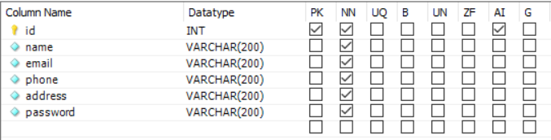
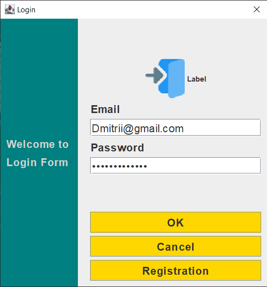
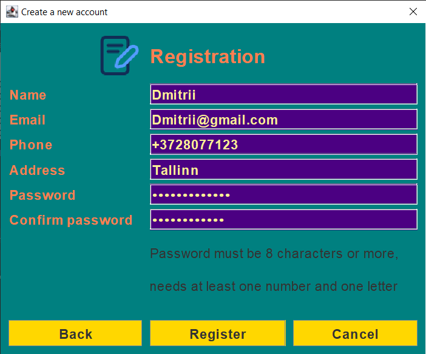
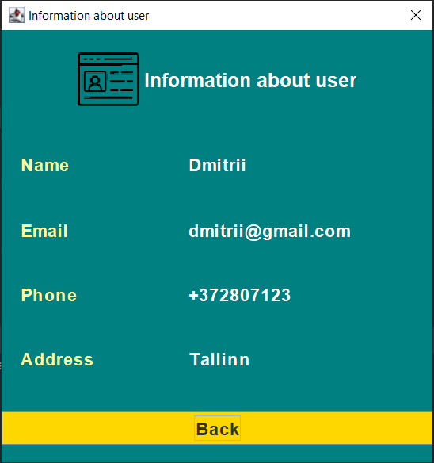

# Register-Login System

## Introduction

Register-Login system  is a user authentication system that allows users to securely log in to their existing accounts, register new accounts, or check their accounts' information. All the communication between the user and the program happens through the UI.

Languages used in the project: Java Swing(frontend), Java(backend).
Information about users is stored in the MySQL database.

## Features Introduced

- User Registration: Easily create a new account by providing essential details.

- User Authentication: Securely log in using registered credentials.

- Password requirements: Password must be 8 characters or more, needs at least one number and one letter

- User Friendly Interface: Intuitive interface for a smooth user experience during registration and login.

- Account information: After authentication user can check information about account

## Installation instructions

- Run `LoginForm.java` file after that open .iml file and add this code  :
```
<orderEntry type="module-library">
          <library>
            <CLASSES>
              <root url="jar://$MODULE_DIR$/mysql-connector-j-8.1.0.jar!/" />
            </CLASSES>
            <JAVADOC />
            <SOURCES />
          </library>
        </orderEntry>
```
  
- Download MySQL

- Create connection with the following settings: Connection Method Standard(TCP/IP), Hostname: `127.0.0.1`, Port: `3306`, Username: `root`, Password: `68ezonaT`
  
- Create database with name: `newdatabase`. In this database create Table with name: `newdatabase` with following settings: 



- Open Database window in Intellij IDEA and add datasource from MySQL with following parameters: Host: `localhost`, Port `3306`, User: `root`, Password: `68ezonaT`, Database: `newdatabase`.

## User instructions

- To use the program, user needs to run `LoginForm.java` file
- After that a Login window will pop up
- Login window:
   - User can log into his account for this he must enter the email and password and push the button `OK`
   - User can close the window by clicking `Cancel` button
   - User can register new account by clicking `Registration` button, Registration window will pop up
  

- Registration window: 
   - User can register new account for this he must enter his name, email, phone number, address, password, confirm passowrd and push the `Register` button
   - User can close the window by clicking `Cancel` button.
   - User can return to Login window for this he must push `Back` button


- Information window:
   - User can check information about account
   - User can return to Login window by clicking `Back` button


  
